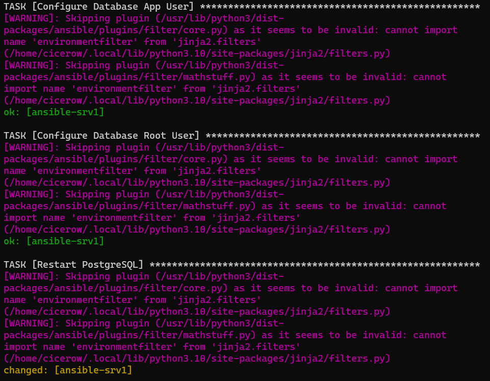

# Ansible + Docker Playground

Este repositório demonstra como criar um ambiente baseado em Docker para praticar o Ansible. [Ansible](https://www.ansible.com/) é uma ferramenta de automação de código aberto que simplifica o gerenciamento de configuração e a implantação de aplicativos.

Podemos evitar a necessidade de máquinas virtuais e economizar recursos do sistema usando contêineres Docker como servidores. Os contêineres do Docker consomem menos recursos, incluindo CPU, memória e espaço em disco, em comparação com as máquinas virtuais.

O Dockerfile neste repositório cria uma imagem com suporte a SSH e SystemD, permitindo simular servidores e instalar serviços usando Ansible. Esta imagem também suporta sudo sem senha para facilitar a manipulação de comandos privilegiados.

Mesmo tratando de um ambiente para praticar, este repositório mostra uma forma segura de implantar containers com acesso SSH. Essa é uma das melhores maneiras de proteger o acesso a servidores expostos na Internet.

## Requisitos

- Instalação padrão do Docker.
- Kit de build do Docker (export DOCKER_BUILDKIT=1) (opcional).
- Instalação do cliente SSH.

## Criar Chaves SSH

Para garantir a forma mais segura de acessar seu ambiente, é recomendável criar chaves SSH e salvá-las em suas imagens. Mantenha as chaves privadas em um local de armazenamento seguro enquanto distribui as chaves públicas correspondentes na imagem do Docker.

```bash
ssh-keygen -P "" -t rsa  -b 4096 -C "root@server.local" -f ansible_root_rsa_key
ssh-keygen -P "" -t rsa  -b 4096 -C "user@server.local" -f ansible_user_rsa_key
```

## Criar a Rede Docker

Para ter um melhor controle sobre os endereços IP atribuídos a cada contêiner/servidor, é necessário criar uma rede usando uma faixa de IP diferente. O Docker já usa o intervalo 172.17.0.0/16 por padrão, então recomendamos usar o próximo bloco disponível.

```bash
docker network create \
    --subnet 172.18.0.0/16 \
    --gateway 172.18.0.1 \
    --driver bridge \
    ansible-net
```

## Construir Imagem

Você pode simplesmente criar uma imagem com opções padrão. Se seu Dockerfile estiver protegido, você pode definir os argumentos (USER_NAME, USER_PASS, ROOT_PASS) com os valores apropriados dentro do arquivo. Demora alguns minutos (quase 10 em meus testes) dependendo dos recursos do seu computador.

```bash
docker build -t ansible-srv .
```

Mas a maneira mais segura é definir os argumentos no comando build sem salvar no histórico de comandos:

```bash
  docker build -t ansible-srv \
  --build-arg USER_NAME=cicerow \
  --build-arg USER_PASS=YourStrongPass_123 \
  --build-arg ROOT_PASS=YourStrongPass_123 .
```

## Rodar Contêineres

Para executar os servidores, use o loop for a seguir. Neste exemplo, o comando criará dois servidores. Você pode alterar o número na primeira linha para definir o número necessário de servidores necessários. Cada servidor terá um IP seguindo a sequência: 172.18.1.1, 172.18.1.2, e assim sucessivamente. Todos esses servidores publicam a porta TCP/22 usando um mapeamento como: 0.0.0.0:32769->22/tcp.

```bash
for x in {1..2}
do
  docker run --name ansible-srv$x \
    --detach \
    --privileged \
    --cap-add SYS_ADMIN \
    --security-opt seccomp=unconfined \
    --cgroup-parent docker.slice \
    --cgroupns private \
    --net ansible-net \
    --ip 172.18.1.$x \
    --dns 1.1.1.1 \
    --hostname ansible-srv$x \
    --publish 22 \
    ansible-srv
done
```

Liste todos os contêineres e verifique o IP para garantir que está tudo certo.

```bash
for x in {1..2}
do
  echo -n "ansible-srv$x = "
  docker inspect -f \
    '{{range.NetworkSettings.Networks}}{{.IPAddress}}{{end}}' \
    ansible-srv$x
done
```

## Testar Acesso

Para testar se o acesso SSH está funcionando, use estes comandos. A primeira linha testa o acesso usando a conta root e a segunda testa o acesso usando uma conta comum.

```bash
ssh -o "StrictHostKeyChecking no" -i ansible_root_rsa_key root@172.18.1.1
ssh -o "StrictHostKeyChecking no" -i ansible_user_rsa_key cicerow@172.18.1.1
```

## Testar SystemD

Para testar se o SystemD está funcionando, use o seguinte comando. O comando lista todos os serviços e outros recursos controlados pelo SystemD.

```bash
docker container exec -it ansible-srv1 systemctl
```

## Remover Tudo

Para remover todos os componentes usados nesta instalação, execute os comandos abaixo. Eles removerão os contêineres, a imagem e a rede.

```bash
for x in ansible-srv{1..2}
do
  docker rm --force $x
done
docker image rm ansible-srv
docker network rm ansible-net
```


# Configuração do Ansible

Para instalar o Ansible, use o comando recomendado para seu sistema operacional ou distribuição. Para o Ubuntu e outros derivados do Debian, você pode usar o seguinte comando. Você também pode usar o Python para instalar o Ansible. Verifique a [documentação](https://docs.ansible.com/ansible/latest/installation_guide/intro_installation.html) se necessário.

```bash
sudo apt install ansible
```

Para criar um novo arquivo de hosts, use os seguintes comandos. Estamos criando um grupo com todos os servidores e incluindo nome e IP. No arquivo **group_vars/ansible_servers.yml** existem outras variáveis.

```bash
echo '# Hosts configuration
[ansible_servers]' > hosts
for x in {1..2}
do 
  echo "ansible-srv$x ansible_host=172.18.1.$x" >> hosts
done
echo "" >> hosts
```

A configuração em **group_vars/ansible_servers.yaml** aplicado a todos os servidores do grupo com o mesmo nome no arquivo **hosts** apresenta quatro configurações:

- **ansible_ssh_private_key_file**: indica o arquivo de autenticação.
- **ansible_ssh_common_args**: indica os argumentos usados no acesso do cliente SSH.
- **ansible_port**: indica a porta TCP SSH.
- **ansible_shell_executable**: indica o comando shell padrão a ser executado nos servidores.

Para testar a comunicação com todos os servidores, use um comando para verificar o tempo de atividade e a localização do interpretador Python (deve ser o mesmo caminho usado no ansible.cfg):

```bash
ansible -m shell -a "uptime" ansible_servers
ansible -m shell -a "which python3" ansible_servers
```

## Examplos

Confira alguns exemplos na pasta **playbooks**:
- **example01.yaml**: usa um servidor para executar um aplicativo Python/Flask simples que executa a cifra tenispolar. Verifique mais informações no arquivo **[example01.md](playbooks/example01.ptBR.md)**.

##  Known issues:
- Este ambiente executa contêineres em modo privilegiado como root, o que é aceitável apenas para fins de teste e aprendizado. Inclua a instrução USER em seu Dockerfile para evitar isso.
- Observe que não funciona no WSL (Windows Subsystem for Linux) devido ao requisito do cgroupv2. Se você deseja usá-lo no WSL, deve primeiro instalar [WSL SystemD support](https://devblogs.microsoft.com/commandline/systemd-support-is-now-available-in-wsl/).
- O comando de teste SSH usa a opção **StrictHostKeyChecking no** para evitar um prompt de acesso inicial. Sinta-se à vontade para alterar esse comportamento, se desejar ou se for necessário um ambiente mais seguro.
- Se você remover um contêiner e criá-lo novamente, o cliente SSH exibirá um aviso indicando uma alteração na identificação do host remoto. Isso é normal, pois uma nova chave (e impressão digital) é criada para os hosts.
- Se você receber um aviso como o apresentado em image1, você deve fazer o downgrade de sua biblioteca Jinja2 ```python3 -m pip install Jinja2==3.0``` para a versão 3.0.



*Image1 - Alerta sobre a versão do Jinja*


## Referências

- [https://serverfault.com/questions/1053187/systemd-fails-to-run-in-a-docker-container-when-using-cgroupv2-cgroupns-priva](https://serverfault.com/questions/1053187/systemd-fails-to-run-in-a-docker-container-when-using-cgroupv2-cgroupns-priva)
- [https://medium.com/swlh/docker-and-systemd-381dfd7e4628](https://medium.com/swlh/docker-and-systemd-381dfd7e4628)
- [https://docs.ansible.com/ansible/latest/installation_guide/intro_installation.html](https://docs.ansible.com/ansible/latest/installation_guide/intro_installation.html)

