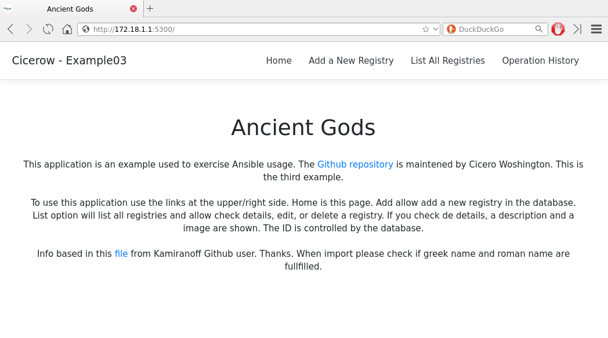
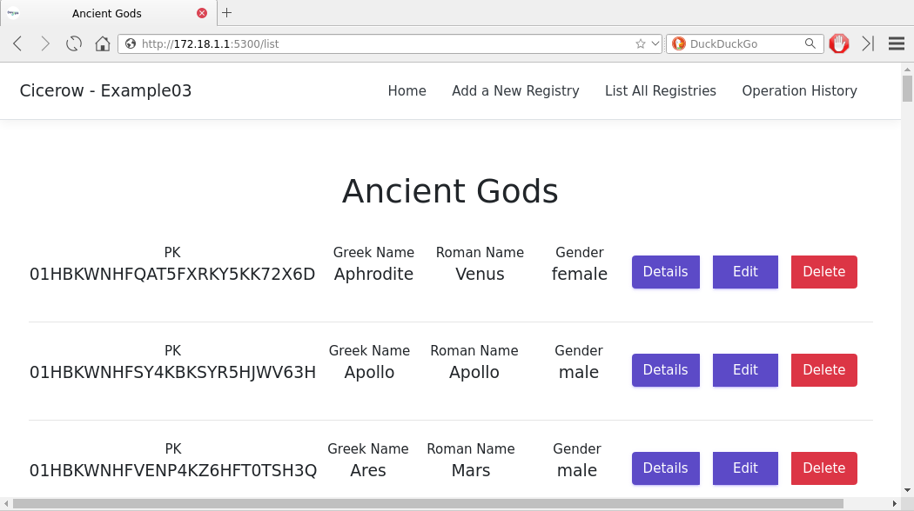
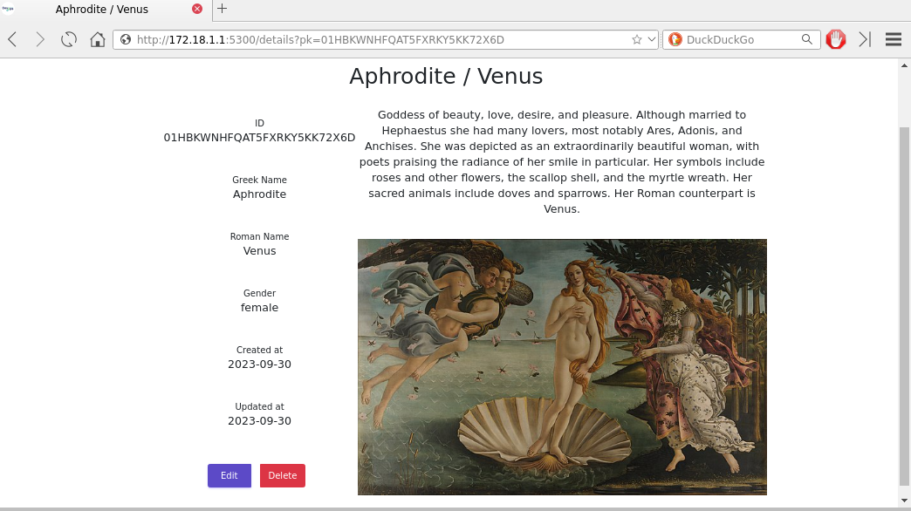
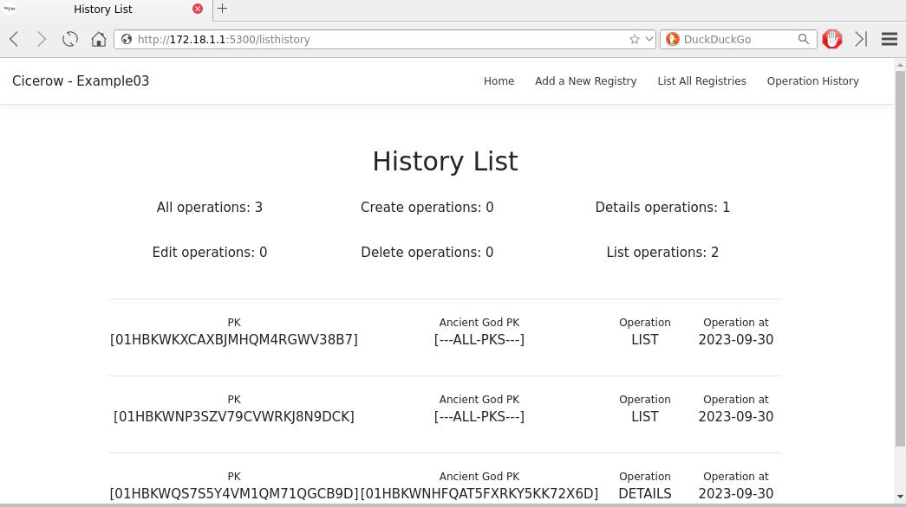

# Example 03

This example uses Docker-in-Docker and worked fine in WSL. Also uses roles and `set_fatc` instead `vars`. 

"Ansible facts are data (system data and properties) gathered about target nodes and returned back to the controller node." [reference](https://www.redhat.com/sysadmin/playing-ansible-facts) Using set_fact the admin can add other information the Ansible facts set to the hosts. With `cacheable: no` the facts added to the hosts are available to all plays inside the same playbook. If it is changed to `yes` the values are saved across execution using a fact cache.

Roles are sequences of tasks added to plays to improve reuse. In this example, we have the roles `install_docker_single_mode` to install the Docker service on Ansible hosts and `create_container_redis` to create a container running the Redis stack. All other steps use tasks. All roles must be stored inside the `roles` folder using this structure:

```
playbooks/roles/
├── create_container_redis
│   └── tasks
│       └── main.yml
└── install_docker_single_mode
    └── tasks
        └── main.yml
```

The `roles` directory must be at the same level as playbooks files. The directory name inside roles is the role name. A file named `main.yml` inside the tasks folder contains all tasks.

## Install Docker Single Mode

This role installs Docker and has eight tasks:

- **Install Aptitude**: Ensure the last version of aptitude is installed.
- **Install Required System Packages**: Install the packages used during Docker installation.
- **Add Docker GPG APT Key**: Add GPG APT key from the Docker repository.
- **Check Debian/Ubuntu Codename**: Get the correct codename from Debian or Ubuntu distributions.
- **Add Docker Repository**: Add Docker repository to APT configuration.
- **Update APT and Install docker-ce**: Update APT and Install Docker Community Edition.
- **Start Docker Service**: Start Docker service to ensure it is running.
- **Install PIP Library to Ansible Docker Modules**: Install PIP Library used by Ansible Docker modules to control containers and other configuration.

No facts or variables are used in this role.

## Create Container Redis

This role creates a Redis container. It uses four facts as variables:

- **redis_service_port**: TCP port used by the server.
- **redis_insight_port**: TCP port used by the web panel.
- **redis_default_password**: The password used by default.
- **redis_server_volume_path**: The volume used to preserve Redis data.

The role has three tasks:

- **Create Redis Data Directory**: Create a directory to store Redis data in Ansible node.
- **Pull Redis Image From Docker Hub**: Pull the image from Docker Hub (it takes much time according to your Internet connection speed).
- **Start/Restart a Redis Container**: Start a Redis container running the Redis Stack using the configuration.

## Other Steps

All other steps use task instead of roles. This can be justified because all these steps are specific to the code used in the third example. Then, they have low potential for reuse.

The next tasks are:

- **Create Application Code Zip File**: Create a zip file with code content in admin's machine.
- **Create Application Directory**: Create a directory to receive the application code and to be used as a volume.
- **Send the Application Code Zip file**: Extract the content of the zip file to the application directory.
- **Download Application Base Container**: Download the image used by the application (it takes much time).
- **Create Application Container**: Start the container with the new application and all needed commands.

These steps could be easily adapted to use a `git clone` command instead of a zip file. But here I want to maintain all needed files in only one repository.

## The application

This application is based in a list of [Kamiranoff](https://github.com/kamiranoff/greek-mythology-data/blob/master/data/all.json) repository with almost 7,000 ancient gods. This is an application based in Flask and Redis-OM to map objects to hash regitries inside Redis database.

This is a complete CRUD with all HTML templates redered by Flask. Check the code and home route to understand better the details about the application. Here, some prints to preview some operations:

<center>

<br>
_Home screen_

---

<br>
_List of Gods_<br>

---

<br>
_Details of Aphrodite_<br>

---

<br>
_List of Operations_<br>

---
</center>


